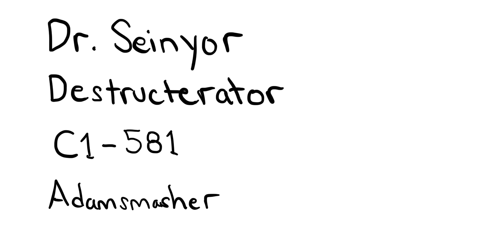
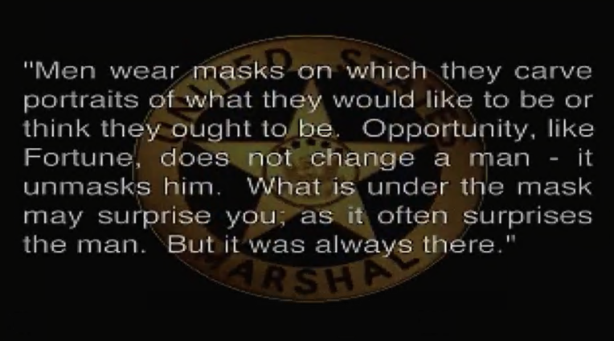

# Dr. Seinyor

Related: [[The exact details of the Super Family]] | [[The Return of Dr. Seinyor]] | [[docs/ship|The Ship]] | [[Iguazu Falls]] | [[Anagrams]]

Dr. Seinyor mobbed by police, he had to be secured.
This was like a reconstruction of the great Super Army. 
Like when the Brickster took over Lego Island.
First, the police station, and we require an armored combat vehicle.
Which AC is now active? Put it on steam deck. Emulate the Gen 3 titles
Heck, emulate the 360 titles.
We have to know what the name is. It was White Glint to bring down the Lich King.

Since it's May the Fourth, let's rebuild the Trade Federation tank. Seems like a good start.
The Super Army was because I was jealous of their robot army. 
Troop carrier. We've got all kinds of vehicles to use.
We put the pieces back together.

  
# Get them Robux   
# Content for children. https://en.wikipedia.org/wiki/Adopt_Me! [https://www.roblox.com/](https://www.roblox.com/)   
  
Makuta voice clips Super Family  
  
# dr.seinyor@outlook.com  
  

You are a RECLAIMER like 343 said to Master Chief - index  
